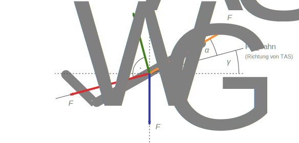
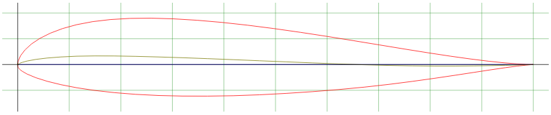
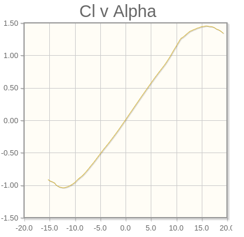
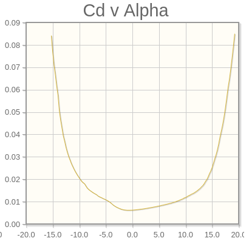
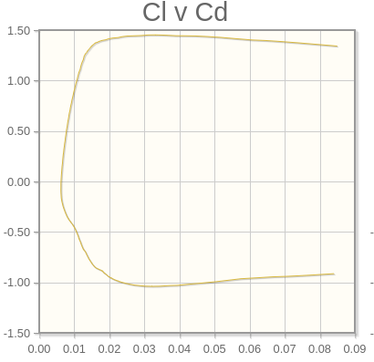
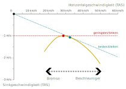

## Fluggeschwindigkeiten
Es gibt 3 relevante Arten, die [Fluggeschwindigkeit](https://de.wikipedia.org/wiki/Fluggeschwindigkeit) anzugeben
1. **Groundspeed (GS)**: Geschwindigkeit über Grund, d.h. wie viel Strecke macht man pro Zeit. Diese kann z.B. per GPS gemessen werden. Damit kann bestimmt werden, wie weit man mit der aktuellen Höhe noch fliegen kann.
2. **True Airspeed (TAS)**: Geschwindigkeit relativ zu der umgebenden Luftmasse. $TAS = GS - Windspeed$. Bsp.: Man fliegt mit 30 km/h TAS, der Wind weht aber mit 10 km/h gegen die Fahrtrichtung -> man hat nur noch 20 km/h GS. Ebenfalls spielt Steigen oder Sinken durch Nicken eine Rolle, diese kann die TAS momentan verringern/vergrößern. Ausnahme: Thermik! Hier steigen auch die umgebenden Luftmassen, d.h. bei konstantem Steigflug in der Thermik ist die TAS konstant. Die TAS ist entscheidend für alle Luftkräfte, d.h. wenn die minimale Fluggeschwindigkeit in TAS unterschritten wird (erkennbar am Ausbleiben der Fahrtgeräusche) kommt es zum Strömungsabriss.
3. **Indicated Airspeed (IAS):** Geschwindigkeit relativ zur umgebenden Luftdichte $\rho$. $IAS = TAS*\sqrt{\rho/\rho0}$. $\rho0$ ist der Druck auf Meereshöhe. Bei gleicher IAS treffen in unterschiedlichen Höhen trotzdem gleich viele Luftteilchen auf den Flügel. Die IAS wird z.B. im Flugzeug mit dem Fahrtmesser angezeigt, da sie sozusagen eine dichtebereinigte Fluggeschwindigkeit angibt. Da die Luftdichte in den Gleichungen für alle Luftkräfte vorkommt, verändern sich die Luftkräfte gleichermaßen zur relativen Änderung der Luftdichte. Bei gleicher IAS herrscht gleicher Auftrieb. Beispiel: Wenn man in 2000 m Höhe fliegt, hat die Luft nur noch ca. 80% der Dichte wie auf Meereshöhe und man muss $1/\sqrt{\rho/\rho0} = 1/\sqrt{0.8}  = 12\%$ schneller fliegen, um die gleiche IAS zu haben und damit den gleichen Auftrieb zu erzeugen. Siehe [Internationale Standardatmosphäre ISA](https://www.dwd.de/DE/service/lexikon/begriffe/S/Standardatmosphaere_pdf.pdf?__blob=publicationFile&v=3). Wichtig: Die Flugeigenschaften des Profils bleiben abhängig von der TAS! D.h. wenn man mit steigender Höhe schneller fliegt um den gleichen Auftrieb zu haben, nähert man sich der maximalen Fluggeschwindigkeit an und der Schirm wird z.B. instabiler.

## Flugzustandsgleichungen
An jedem Fluggerät wirken normalerweise 4 Kräfte: Das Gewicht des Gesamtsystems, Auftrieb und Widerstand des Flügelprofils und (falls vorhanden) Schub durch einen Propeller. Wenn das Flugzeug/der Gleitschirm stationär d.h. ohne Beschleunigung in alle Richtungen fliegt, befinden sich diese 4 Kräfte im Gleichgewicht. Das Verhältnis der Kräfte ergibt sich dabei aus folgendem Schaubild:

Daraus ergeben sich die Flugzustandsgleichungen im Gleichgewicht:
$Schub*cos(\alpha) - Widerstand - Gewicht*sin(\gamma) =0$
$Auftrieb - Gewicht*cos(\gamma) + Schub*sin(\alpha) = 0$

mit
$\alpha$ - Anstellwinkel des Flügels gegenüber der Flugbahn
$\gamma$ - Bahnwinkel der Flugbahn gegenüber der Horizontalen

Beim Gleitschirm (ohne Paramotor) ist der Schub = 0, deshalb ergibt sich:
$Widerstand = -Gewicht*sin(\gamma)$
$Auftrieb = Gewicht*cos(\gamma)$
Die Flugbahn zeigt dann (in den allermeisten Flugzuständen) im Bezug zur Horizontalen nach unten. Demnach wirkt der Auftrieb nach vorne oben und der Widerstand nach hinten oben, siehe [Wikipedia](https://de.wikipedia.org/wiki/Flugman%C3%B6ver_und_Flugzust%C3%A4nde_(Gleitschirm)).

## einzelne Luftkräfte im Detail
- Auftrieb $F_A = C_L * Luftdichte/2 * v^2 * A$
- Widerstand $F_W = C_D * Luftdichte/2 * v^2 * A$
- Gewichtskraft $F_G = m * g$

mit
$C_L$ - Auftriebsbeiwert (Profileigenschaft, abhängig von Anstellwinkel $\alpha$)
$C_D$ - Widerstandsbeiwert (Profileigenschaft, abhängig von Anstellwinkel $\alpha$ )
A - Flügelfläche
v - Fluggeschwindigkeit (True Airspeed TAS)
m - Gesamtmasse
g - Erdbeschleunigung (g=9.81 m/s²)

### Auftrieb
Die [Auftriebskraft](https://de.wikipedia.org/wiki/Dynamischer_Auftrieb) $F_A$ wird vom Flügel erzeugt und entsteht durch den Druckunterschied zwischen Profil Unter- zu Oberseite. Es herrscht niedriger Druck auf der Oberseite, da hier die Luftteilchen durch die höhere Krümmung des Profils mehr beschleunigt werden. Durch die Beschleunigung sinkt der Druck nach der [Bernoulli-Gleichung](https://de.wikipedia.org/wiki/Bernoulli-Gleichung). Dadurch entsteht ein Sogeffekt, der den Flügel nach oben "saugt". Zusätzlich entsteht Auftrieb, da durch den angestellten Flügel Luftteilchen nach unten abgelenkt werden. Die Gegenkraft drückt den Flügel nach oben (Impulserhaltung). Je größer die Flügelfläche, der Auftriebsbeiwert $C_L$ des Profils und je höher die Fluggeschwindigkeit, um so höher der Auftrieb (siehe Gleichung für $F_A$). Wie bereits oben beschrieben muss man beim Absinken der Luftdichte auf 80% der Dichte im Vergleich zur Meereshöhe um $1/\sqrt{\rho/\rho0} = 12\%$ schneller fliegen, um den gleichen Auftrieb zu erzeugen (Das Verhältnis ist nicht 1:1, da die Fluggeschwindigkeit quadratisch im Auftrieb vorkommt).

### Widerstand
Die [Widerstandskraft](https://de.wikipedia.org/wiki/Str%C3%B6mungswiderstand) $F_W$ setzt sich aus vielen einzelnen Anteilen zusammen.
- Der **schädliche Widerstand** auch (Druckwiderstand/Formwiderstand) ergibt sich durch die Druckverlust der umströmenden Luft durch Ablenkung um den Körper herum. Er wird maßgeblich durch die Form des Körpers bestimmt (bzw. seine Anströmfläche). Ein flacher, schmaler Körper erzeugt weniger schädlicher Widerstand als eine senkrechte Wand.
- Der **Reibungswiderstand** ergibt sich durch das Verlangsamen der Strömung an der Oberfläche des Körpers durch Reibung. Er wird maßgeblich durch die Rauigkeit der Oberfläche bestimmt.
- **Induzierte Widerstand** entsteht immer dann, wenn ein Körper Auftrieb erzeugt. Durch den Druckunterschied zwischen Unter- und Oberseite fließt am Rand des Flügels ein Teil der Strömung nicht über die gesamte Flügeltiefe, sondern fließt auf halbem Weg seitlich über den Flügelrand herum (von der Unterseite zur Oberseite). Dies erzeugt Randwirbel, die von nachfliegenden Piloten gespürt werden können. Wirbelschleppen durch Randwirbel des Gleitschirms können bis zu 30 s bestehen. Niemals in Wirbelschleppen von Flugzeugen fliegen, diese bestehen deutlich länger und sind stärker.
- **weitere Widerstände** (Widerstand durch weitere Körper wie Leinen oder den Pilot, Interferenzwiderstand zwischen einzelnen Elementen, ...)
Der schädliche Widerstand und der Reibungswiderstand werden im Widerstandsbeiwert $C_D$ zusammengefasst. Dieser gibt dimensionslos die Eigenschaften des Flügelprofils an, d.h. dem 2D-Schnitt des Flügels ohne Berücksichtigung seiner 3-dimensionalen Ausdehnung. Man kann es sich als die Eigenschaften eines Flügels vorstellen, der unendlich lang gestreckt ist und dabei immer das gleiche Profil hat. Für das Errechnen der realen Flügeleigenschaften müssen die veränderliche Tiefe des Flügels, induzierter Widerstand am Flügelende und alle weiteren Abweichungen vom idealen, unendlichen 2D-Flügel berücksichtigt werden. Allgemein gilt, dass (bei konstanter Flügelfläche) bei größerer [Streckung](https://de.wikipedia.org/wiki/Streckung_(Tragfl%C3%A4che)) (Flügel breiter, aber weniger tief) der induzierte Widerstand sinkt, dafür aber der Reibungswiderstand zunimmt. Die optimale Streckung wird definiert durch die Anforderungen an die Fluggeschwindigkeit, Klappstabilität, Leistung vs. Manöverierbarkeit, ...

**Besonderheiten beim Gleitschirm:**
- Beim Gleitschirm ändert sich das Flügelprofil und teilweise auch die Fläche durch das Ziehen der Bremsleine -> Profilpolaren sind nur eine Annäherung
- Die [Flächenbelastung](https://de.wikipedia.org/wiki/Fl%C3%A4chenbelastung_(Fl%C3%BCgel)), also das Verhältnis von Gesamtgewicht zu Schirmgröße, beeinflusst die Gleichgewichtslage Fluggeschwindigkeit zu Anstellwinkel -> je geringer die Flächenbelastung desto langsamer der Flug. Dies hat Einfluss auf die [Geschwindigkeitspolare](Aerodynamik#Geschwindigkeitspolare)
- Der Gleitschirm hat eine Pendelstabilität (Rollen und Nicken), Gierstabilität wird durch Pfeilung und durch Rundung im Flügel erzeugt (vergleichbar mit Seitenleitwerk)
- Die Reduzierung der Leinenanzahl senkt den Interferenzwiderstand. Um trotzdem die Profiltreue beizubehalten werden diagonale Rippen eingesetzt -> große Reduzierung des Gesamtwiderstands
- Der Bodeneffekt spielt beim Gleitschirm keine Rolle da der Gleitschirm relativ zu seiner Größe weit weg vom Boden ist (beim Drachen ist das anders). D.H. es gibt keinen natürlichen "Flare" durch ansteigenden Auftrieb in Bodennähe

## Flügelprofil
Der Verlauf der Beiwerte $C_L$ & $C_D$ wird durch die Form des [Profils](https://de.wikipedia.org/wiki/Profil_(Str%C3%B6mungslehre)) bestimmt. Die wichtigsten Profileigenschaften sind die **Profildicke** (dickste Stelle) und die **Wölbung** der Profilsehne, sprich das Abkippen der Profilhinterkante nach unten. Die Profilsehne ist die Verbindung der Vorderkante mit der Hinterkante und hat dabei immer den gleichen Abstand zur Ober- wie zur Unterseite. Daneben ist vor allem die Form der Vorderkante, die Position der maximalen Dicke und der Verlauf der Profilsehne wichtig.
**Anmerkung:**
Im 2D können 3D-Effekte wie induzierter Widerstand oder Interferenzwiderstand nicht berücksichtigt werden. Das Profil kann sich entlang der Spannweite ändern, insbesondere nimmt die Flügeltiefe weiter außen am Flügel ab. Dies verändert die Eigenschaften des Profils, allerdings ist es einfacher mit einem repräsentatives "Durchschnittsprofil" des Flügels zu rechnen und dieses mit anderen Profilen zu vergleichen. Desweiteren weicht das reale Profil  durch Fertigungsabweichungen und vor allem durch das Aufblähen des Stoffs zwischen den Rippen vom Sollprofil ab, was zu einer weiteren Verschlechterung der Flugleistung führt.
Ein Beispielprofil für ein Gleitschirm-Flügelprofil (und die folgenden Polaren): MH91 [http://airfoiltools.com/airfoil/details?airfoil=mh91-il](http://airfoiltools.com/airfoil/details?airfoil=mh91-il)

## Profilpolaren
Die Profilbeiwerte $C_L$ & $C_D$ dieses 2D-Flügelprofils sind entscheidend für die Performance des Flügels und werden in sogenannten Profilpolaren angegeben. Darin wird der Verlauf der Profilbeiwerte über dem Anstellwinkel $\alpha$ angegeben. Die Polaren sind jeweils von der Anströmgeschwindigkeit und der Oberflächenrauigkeit abhängig.
Der **Auftriebsbeiwert** $C_L$ gibt an, wie viel Auftrieb für welchen Anstellwinkel erzeugt werden kann. Bei steigendem Anstellwinkel steigt auch der Auftrieb, bis zu einem [maximalen/kritische Anstellwinkel](https://de.wikipedia.org/wiki/Anstellwinkel), bei dem es zum **Strömungsabriss** kommt. Der **Widerstandsbeiwert** $C_D$ gibt an, bei welchem Anstellwinkel welcher Widerstand entsteht.
Die **Profildicke** definiert dabei maßgeblich die Bandbreite an möglichen Anstellwinkeln. Dünne Flügel erzeugen zwar weniger Widerstand, dafür ist das Profil aber weniger gutmütig, erlaubt weniger Anstellwinkelvariation und reißt beim maximalen Anstellwinkel hart ab. Erklärung: Ein dünnen Profil hat eine scharfe Vorderkante, deshalb wird die Luft sehr schnell beschleunigt. Wenn nun der Anstellwinkel zunimmt, nimmt auch die Beschleunigung zu. Somit wird der kritische Anstellwinkel schneller erreicht, bei dem die Strömung dem Profil nicht mehr folgen kann und es zum Strömungsabriss kommt. 
Die **Profilwölbung** erhöht den Widerstand über alle Anstellwinkel, dafür werden aber die möglichen Anstellwinkel Richtung höhere Anstellwinkel verschoben und der Auftriebsbeiwert $C_L$ insgesamt erhöht. So ist es möglich, das bei Anstellwinkel 0° das Profil bereits Auftrieb >0 erzeugt. Grundsätzlich ist es sinnvoll, das Profil so auszulegen, dass man im Trimmflug einen Anstellwinkel mit wenig Widerstand hat, man sich aber auch bei zunehmenden Anstellwinkeln immer noch im "flachen" Bereich des Widerstandsbeiwerts $C_D$ befindet.

**Anmerkung zum Anstellwinkel:**
Relevant für den Anstellwinkel des Profils ist immer die Richtung der anströmenden Luft (äquivalent wie bei der True Airspeed). Im Normalzustand sinkt man gegenüber der umgebenden Luft, der Anstellwinkel ist verhältnismäßig kleiner. In der Thermik steigt die umgebende Luft, der Anstellwinkel ist kurzzeitig sehr groß. Gleiches gilt für Gegenwind/Rückenwind, auch dieser beeinflusst die Anströmung an das Profil.

**Besonderheit beim Gleitschirm:**
- Negative Anstellwinkel können nur bei starren Flügeln geflogen werden. Beim Gleitschirm strömt nicht mehr genügend Luft in die Eintrittskante und das Profil kollabiert. Technisch gesehen wandert dabei der Staupunkt auf dem Untersegel mit steigendem Anstellwinkel nach hinten und strömt an der Eintrittsöffnung vorbei.
- Durch die Öffnung des Profils und Entnahme von Luft auf der Unterseite verändern sich zudem auch die Profileigenschaften von den theoretischen Werten.
- Das Ziehen der Bremsleine verformt das Profil durch das Herunterziehen der Hinterkante und erhöht die Profilwölbung ähnlich der Landeklappen (Flaps) beim Flugzeug. Dadurch erhöht sich der Auftriebsbeiwert $C_L$ des Profils über alle Anstellwinkel, der maximale Anstellwinkel wird dabei aber reduziert! Das Treten des Beschleunigers senkt den Anstellwinkel im vorderen Flügelbereich (Anstellwinkel im Trimmflug normalerweise > 0°) und reduziert damit den Auftrieb und den Widerstand. Tritt man den Beschleuniger gleichzeitig zum gezogenen Bremse ist das ähnlich dem Ausfahren der Nasenklappe (Slats) beim Flugzeug und verlängert/verschiebt den möglichen Anstellwinkelbereich zu höheren Anstellwinkeln, da die Umlenkung der Strömung an der Flügelspitze geringer ist (siehe dazu Grafiken von: http://www.zenithair.com/stolch801/design/design.html)

**Beispiel zum Thema Luftkräfte - Nicken:**
Beim Manöver Nicken werden die Luftkräfte Auftrieb & Widerstand, sowie die Profilbeiwerte $C_L$ & $C_D$ dynamisch beeinflusst.
- Ausgangslage: Trimmflug
- plötzliches Ziehen der Bremsleine -> Anstellwinkel $\alpha$ nimmt zu
- Auftriebsbeiwert $C_L$ steigt -> Schirm und Pilot steigen hoch
- gleichzeitig steigt der Widerstandsbeiwert $C_D$ aufgrund des größeren Anstellwinkels $\alpha$ -> der Schirm fällt dynamisch hinter den Piloten zurück, $v$ sinkt
- durch das Pendel des Schirms steigt der Anstellwinkel $\alpha$ noch weiter an (der Vorgang ist also selbstverstärkend, Stallgefahr)
- durch das Sinken von $v$ sinken Auftrieb & Widerstand wieder
- am Höhepunkt lässt man die Bremsen schnell los -> Anstellwinkel $\alpha$ nimmt ab
- Auftriebsbeiwert $C_L$  und Widerstandsbeiwert $C_D$ sinken -> Schirm schießt dynamisch nach vorne unten, $v$ nimmt zu, Auftrieb nimmt zu
- durch das Zurückpendeln reduziert sich der Anstellwinkel weiter (auch selbstverstärkend, Frontklappergefahr)

### Gleitverhältnis
Die Performance des Profils lässt sich am besten im Gleitverhältnis vergleichen, sprich dem Verhältnis von Auftrieb zu Widerstand. Da sowohl Auftrieb und Widerstand von $Luftdichte/2  * v^2 * A$  abhängen, entspricht dies dem Verhältnis der Beiwerte $C_L/C_D$. Dieses Verhältnis beschreibt wie weit ein Flugzeug/Gleitschirm mit 1 m Höhenverlust fliegen kann. Genau genommen ist z.B. der Punkt des besten Gleitens der Punkt des maximalen Gleitverhältnisses $C_L/C_D$, was grafisch der Tangente der Ursprungsgerade mit der Kurve entspricht. Dabei muss man allerdings beachten, das sich der genaue Verlauf der Kurve in abhängig von der Fluggeschwindigkeit ändert.

## Datenbank und Tools
Auf http://airfoiltools.com/ sind sehr viele Flügelprofile gelistet, inklusive einer Analyse der Beiwerte wie in den Beispielplots gezeigt. NACA Profile kann man außerdem bei https://xfoil.termoflow.com/ analysieren. So kann man für beliebige Profile den Verlauf der Profilpolaren bei verschiedenen Geschwindigkeiten begutachten.
Beispiel Input:
	- NACA 23015
	- Reynoldszahl: 1.5 Millionen (Profiltiefe 2.7 m) oder 1.65 Millionen (Profiltiefe 3 m)
	- Machzahl: 0.025 (30 km/h) oder 0.016 (20 km/h)
	- Anstellwinkel $\alpha$: 0 - 20° in 1° Schritten

### Geschwindigkeitspolare
Anschaulicher ist das Verhältnis von Horizontal- zu Sinkgeschwindigkeit auch genannt Geschwindigkeitspolare, das sich aus dem Kräftegleichgewicht und den Profilpolaren ableiten lässt. Sie ist im Gegensatz zu den anderen Polaren nicht nur vom Profil, sondern auch von der Flächenbelastung und von der Bremsleinen- und Beschleunigerstellung abhängig:
- Der Graph ist von der Flächenbeladung abhängig, weil das Gesamtsystem Schirm+Pilot mit Masse, Luftwiderstand etc. die Lage des Kräftegleichgewicht bestimmt.
- Durch Betätigen der Bremse oder des Beschleunigers ändern sich Auftriebsbeiwert $C_L$ und Widerstandsbeiwert $C_D$ (und die Flügelfläche), man "wandert" auf der Kurve von Minimalfahrt bis Maximalfahrt.
- Der Verlauf der Geschwindigkeitspolare hängt von der Profilform ab, da diese das Verhältnis von Auftrieb zu Widerstand definiert. Ein flacheres Profil hat weniger Widerstand, aber dafür eine schmalere Bandbreite an Anstellwinkeln. Die Geschwindigkeitspolare wird damit etwas nach oben verschoben sein und insgesamt über den gesamten Anstellwinkelbereich weniger Sinken verursachen (flachere Kurve), dafür im Langsamflug aber weniger mögliche Anstellwinkel bieten. Die Polare eines A-Schirms hat dagegen insgesamt mehr Krümmung und bietet mehr Spielraum über den Bremsleinenzug, dafür geringere Geschwindigkeiten im Beschleuniger.
Die folgende Polare ist nicht von airfoiltools sondern nur beispielhaft:

Der Punkt des geringsten Sinkens ist der Schnittpunkt der Polare mit der roten, horizontalen Linie. Fliegen in diesem Punkt verschafft maximale Zeit für gegebene Höhe. Die Tangente aus dem Ursprung mit der Polare ergibt den Punkt des besten Gleitens. Hier ist das Verhältnis von Auftrieb zu Widerstand optimal und man erreicht den maximalen Gleitwinkel. 
Wichtig: Das Diagramm gilt in ruhiger Luft oder relativ zur umgebenden Luft, die Geschwindigkeiten sind also als TAS zu interpretieren. Herrscht Gegenwind/Aufwind muss die Polare oder das Koordinatensystem zum Bestimmen absoluter Geschwindigkeiten oder Steigraten entsprechend um die Windgeschwindigkeit verschoben werden.

**Beispiel 1 Gegenwind:**
Wenn z.B. 20 km/h Gegenwind herrscht, dann verschiebt sich das Diagramm für absolute Werte über Grund (Groundspeed) um 20 km/h. Die Tangente muss jetzt auf der horizontalen Achse vom Punkt 20 km/h aus gezeichnet werden. Der Punkt des besten Gleitens wandert entsprechend zu höheren Geschwindigkeiten im Beschleuniger, bei Rückenwind entsprechend zu niedrigeren Geschwindigkeiten. Siehe auch: https://www.sicher-fliegen.de/workbook/die-polare/

**Beispiel 2 Thermik:**
Beim Kreisen in der Thermik wird meist im Punkt des geringsten Sinkens geflogen, welcher absolut gesehen das größte Steigen ermöglicht. Im Abwind sollte wieder beschleunigt geflogen werden, sodass man schnell aus den sinkenden Luftmassen herausfliegt. Mit Beschleuniger wird der Schirm klappanfälliger, deshalb in Bodennähe oder bei turbulenter Luft weniger/nicht beschleunigen.

**Beispiel 3 Trimmflaps:**
Falls man im Endanflug zu hoch ist und den Auftrieb verringern will, kann man bei gezogener Bremse noch den Beschleuniger aktivieren -> Die Vorderkante wird heruntergezogen, der tatsächliche Anstellwinkel der Profilnase wird verringert (Slat). Die Polare verschiebt sich dabei insgesamt nach unten (mehr Widerstand) und wird nach links verlängert (größere Anstellwinkel möglich). Das System wird stabiler und der maximal mögliche Bremsleinenzug nimmt zu.

**Faustformeln:**
- bei 10 km/h Wind Beschleuniger etwa 1/3 treten, bei 20 km/h 2/3.
- bei 3 m/s Abwind etwa 1/3 treten, bei 6 m/s etwa 2/3.
