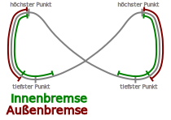

## Tipps
- immer am Hang entlang fliegen, da dort meistens Auftrieb und in der Talmitte meistens Abwind herscht
- Peilen: über Bergflanke etwas Anpeilen (Baum etc.). Wenn immer mehr davon verschwindet, dann kommt man nicht über die Kuppe
- Stabilität: Unterschenkel an das Sitzbrett ranziehen und spreizen

## Nicken (um die Querachse)
- Bremse/Beschleuniger verschiebt Flugzustand im Polarendiagramm
	- Beschleuniger verkleinert Anstellwinkel und erhöht das Sinken
	- Bremse erhöht Anstellwinkel und verringert das Sinken
- Pendelwirkung des Piloten verändert Anstellwinkel des Schirms deutlich!
- wenn der minimale Anstellwinkel unterschritten wird, klappt der Schirm zusammen

## Pendeln
- Gewicht (+Steuerimpuls) in eine Richtung bis Hochpunkt
- Gewicht (+Steuerimpuls) nach dem Hochpunkt erst neutral nehmen zum Schwung holen
- kurz vor dem tiefsten Punkt Gewicht (+Steuerimpuls) voll in die Kurve
- Aufpassen: Außenflügel kann klappen, dann Gewicht unbedingt innen halten und über Kurve ausleiten. Sonst Trudeln + extrem Schießen
- Ausleiten: Gewicht voll auf einer Seite lassen

### Aktives Fliegen
- Dynamisch auf Schirmbewegungen reagieren -> schwere Arme, konstanter Druck und Schirm immer über sich halten
- Dabei auf folgende Signale achten (in dieser Wichtigkeit):
	1. Fahrtgeräusche
	2. Bremsleinenzug
	3. Schirmbewegung vor/zurück
- Beispiel: Wenn sich der Anstellwinkel verringert und/oder der Schirm den Pilot überholt (z.B. durch Pendeln oder Wind) nimmt der Zug an den Bremsleinen ab -> nachziehen.
- Vorgehen:
	- Schirm bleibt zurück -> Bremsen lösen
	- Schirm überholt -> leicht anbremsen
- Aufpassen auf Stall: Schirm grundsätzlich lieber fliegen lassen (Hände hoch), hauptsächlich Vorschießen abfangen (z. B. beim Rausfallen aus der Thermik)
- Gewicht eher passiv lassen. Man kann aber durch Anwinkeln und Spreizen der Beine Spannung und damit Gierstabilität aufbauen.

## Kurven fliegen
- auf Trimmgeschwindigkeit beschleunigen
- **dynamische Körpersteuerung** in Kurvenrichtung
- dabei steuern die Arme automatisch mit, deshalb erstmal keine aktiven Steuerbewegungen, erst wenn man zu pendeln beginnt
- Pendelbewegung (Körperhaltung stimmt nicht zur Kurvengeschwindigkeit) vermeiden
	- kurvenäußere Hand lösen um das Verlangsamen des Schirms auszugleichen, da das Vorpendeln wieder aus der Kurve ausleitet
	- kurvenäußere Hand nachziehen, wenn Schirm zu sehr beschleunigt und nach unten abtaucht
	- kurveninnere Hand nachziehen um die Kurve weiter zu verengen
- zum Ausleiten erst die Bremsleinen lösen, dann langsam Gewicht wieder zu Mitte -> sonst Pendeln

## Rollen

- Der Schirm macht eine Rollbewegung, am höchsten Punkt eine Nickbewegung und dann eine Tauchbewegung in der man wieder unter den Schirm pendelt. Danach von vorne.
- Steuerinputs: Gewicht - Innenbremse - Außenbremse - Freigeben
- beim Drunterpendeln: Gewicht auf Innenseite verlagern
- kurz VOR tiefstem Punkt Innenbremse (danach würde dem Schirm die Energie nehmen -> Verhungern am höchsten Punkt)
- Blick dorthin, wo der Schirm gleich abtauchen wird
- ab dem höchsten Punkt freigeben zum Beschleunigen
- Ausleiten: mit dem Gewicht auf der Innenseite bleiben und über eine Kurve ausleiten. Im tiefsten Punkt kann man über Ziehen der Innenbremse den Gegenpendler verhindern (der Schirm will pendeltechnisch eigentlich gerade auf dieser Seite steigen, diese Energie wird dadurch abgebremst)
- geht auch nur mit Gewicht

## Wingover
- beim Aufsteigen innen nachziehen und mit Außenbremse stabilisieren (nur ab hohem Rollen notwendig, je aktiver man nachzieht umso eher klappt der Schirm außen)
- falls Schirm außen klappt auf offener Seite bleiben und ausleiten

## Vorhalten
- Vorhaltewinkel muss passend zum Wind gefunden werden
- er verhindert unnötiges Sinken
- Peilen über markante Geländepunkte (Kimme und Korn)
